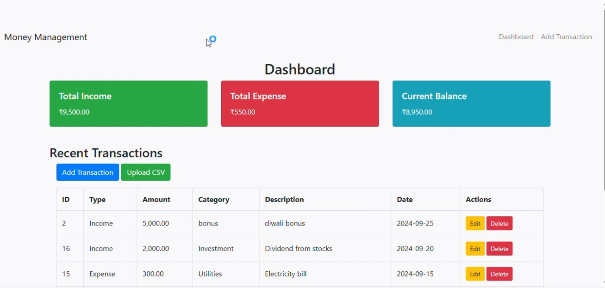
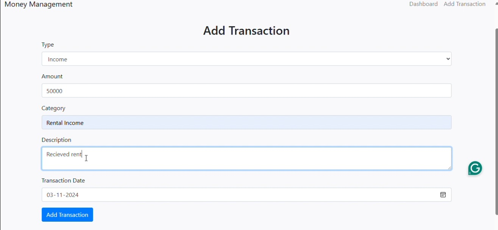
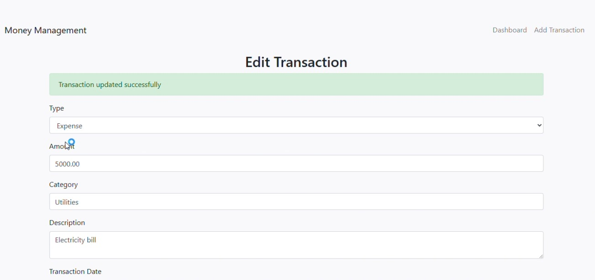
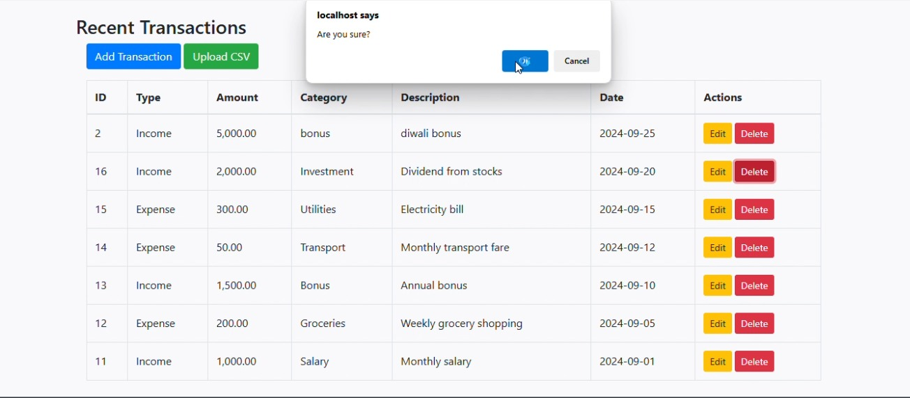
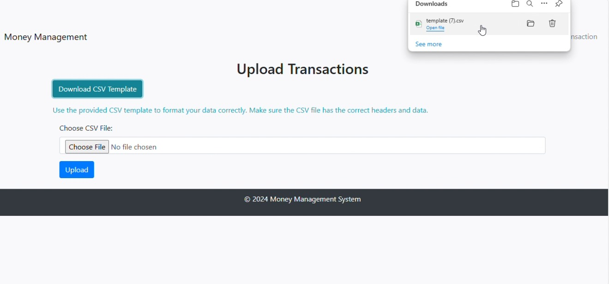
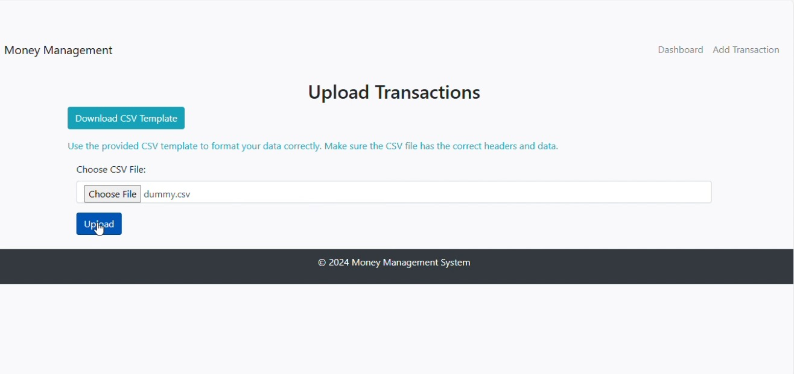
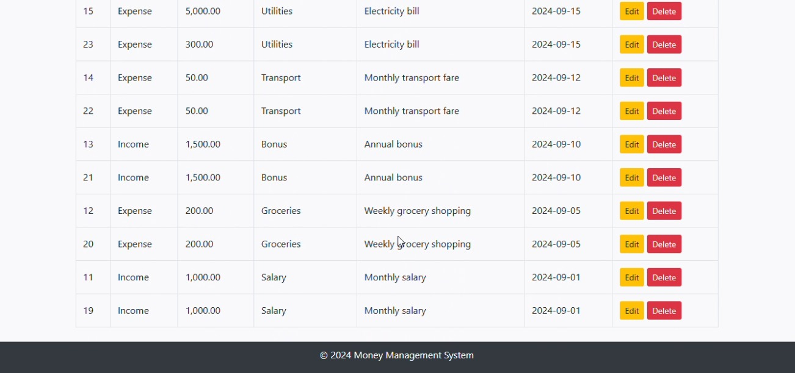

# Money Management System

## Overview

The Money Management System is a web-based financial management application developed using PHP and MySQL. It helps users manage their daily financial activities by recording transactions, tracking expenses, monitoring budgets, and importing transaction data through CSV files.

This project was developed to simplify personal finance management and provide users with a structured way to monitor their spending habits.

---

## Features

### Transaction Management

* Add new income and expense records
* Edit existing transactions
* Delete unwanted transaction entries

### CSV Upload Support

* Import multiple transactions at once
* Reduce manual data entry
* Easy bulk transaction management

### Budget Tracking

* Set financial budgets
* Monitor spending against planned budgets
* Improve financial discipline

### User-Friendly Interface

* Simple and easy-to-use design
* Organized financial records
* Quick access to transaction history

---

## Technologies Used

| Technology | Purpose                      |
| ---------- | ---------------------------- |
| HTML       | Structure of web pages       |
| CSS        | Styling and user interface   |
| PHP        | Backend logic and processing |
| MySQL      | Database management          |

---
### File Description

* **config.php** → Stores application configuration settings.
* **connection.php** → Creates database connection using MySQL.
* **index.php** → Main application page and transaction management interface.
* **upload.php** → Handles CSV file uploads and transaction imports.

---

## Screenshots

### Dashboard



### Transaction Management





### CSV Upload





---

## Installation and Setup

### Clone Repository

```bash
git clone https://github.com/Prachi-Sanyal/Money_Management_System.git
```

### Navigate to Project Folder

```bash
cd Money_Management_System
```

### Configure Database

1. Create a MySQL database.
2. Import the SQL file (if available).
3. Update database credentials in `config.php`.

### Run the Project

1. Place the project inside the XAMPP `htdocs` folder.
2. Start Apache and MySQL from XAMPP.
3. Open the browser and visit:

```text
http://localhost/Money_Management_System
```

---
om/Prachi-Sanyal
